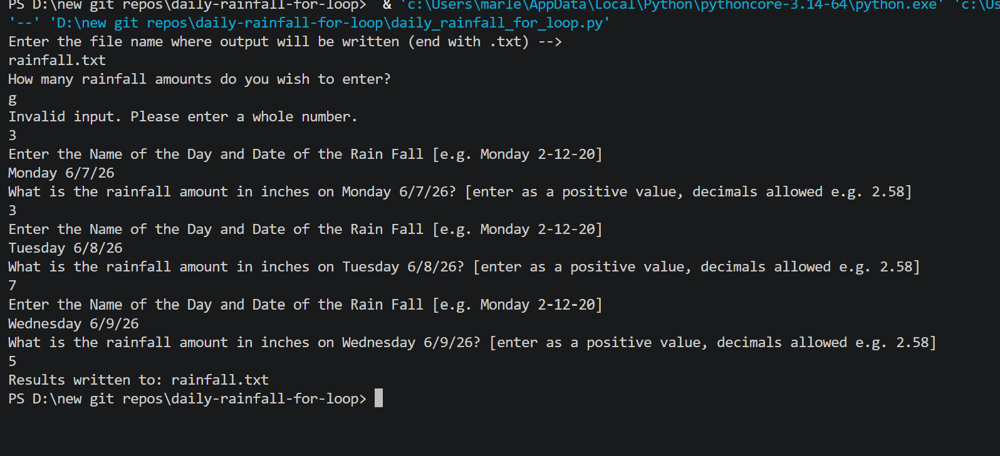

# 🌦️ Daily Rainfall Average Calculator — For Loop

A Python program that uses a **FOR loop** to collect a user-specified number of daily rainfall amounts, writes a formatted table of all entries to an external text file, and calculates the average rainfall.

---

## Features

- Prompts for a user-defined output file name
- FOR loop collects a set number of rainfall entries
- Validates that the entry count is a positive whole number
- Validates each rainfall amount — rejects non-numeric and negative values
- Writes a formatted table of all entries to a `.txt` output file
- Calculates and writes the average rainfall to the output file

---

## How It Works

1. User enters a name for the output file (include `.txt` extension e.g. `rainfall.txt`)
2. User enters how many rainfall amounts to record
3. FOR loop prompts for the day/date and rainfall amount for each entry
4. Each entry is validated and written to the output file
5. After all entries, the average is calculated and written to the file
6. File is closed and user is notified

---

## Example Output File

```
================================================================
NAME OF DAY & DATE             RAINFALL [INCHES]
================================================================
Monday 2-12-20                           2.50
Tuesday 2-13-20                          0.75
Wednesday 2-14-20                        3.10
================================================================
THE AVERAGE RAINFALL AMOUNT = 2.12 INCHES
================================================================
```

---

## Screenshot



---

## Technologies Used

- Python 3
- Count-controlled `for` loop with `range()`
- File I/O — `open()`, `write()`, `close()`
- `while True / try/except` — input validation
- `format()` — aligned column output
- Accumulator pattern

---

## Learning Outcomes

- Writing formatted tabular data to an external text file
- FOR loop with a known iteration count
- Input validation using `while True` and `try/except`
- Accumulator pattern for calculating averages
- Difference between FOR loop and WHILE loop sentinel approaches

---

## How to Run

1. Make sure Python 3 is installed: https://www.python.org/downloads/
2. Clone or download this repo
3. Open a terminal in the repo folder
4. Run: `python daily_rainfall_for_loop.py`
5. Enter a filename when prompted (include `.txt` e.g. `rainfall.txt`) — the report will be created in the same folder

---

## Folder Structure

```
daily-rainfall-for-loop/
├── daily_rainfall_for_loop.py
├── output.png
├── outputTxt.png
├── rainfall.txt
├── README.md
├── LICENSE
└── .gitignore
```

---

## License

This project is licensed under the MIT License — see the [LICENSE](LICENSE) file for details.

---

*Written by Marlena Fabrick — Computer Programming, Fall 2020*


